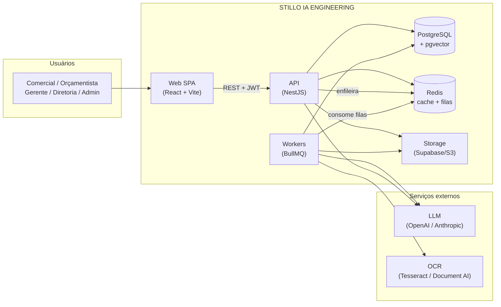
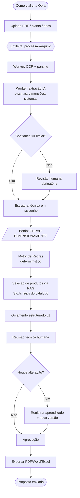
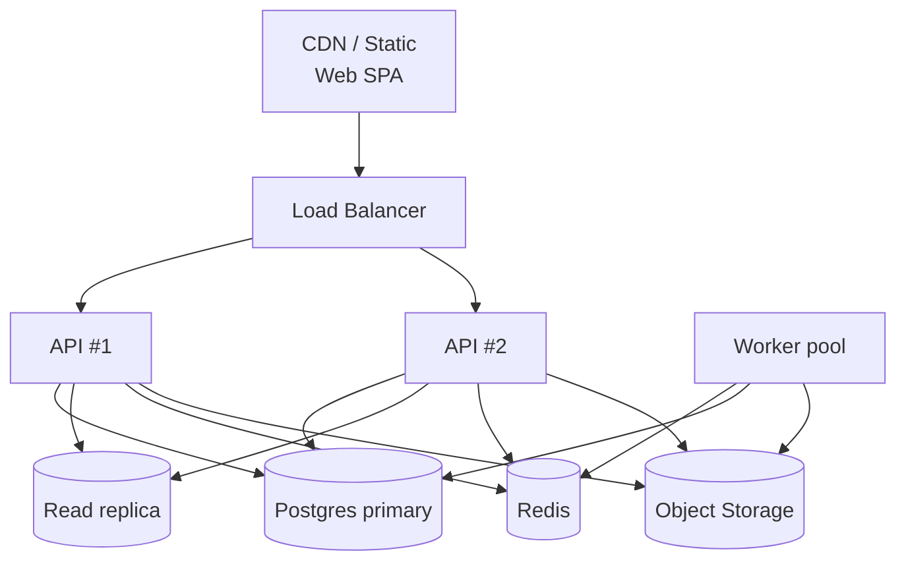

# 01 — Arquitetura Completa

## 1. Visão de contexto (C4 — nível 1)



**Por que essa separação?** A API responde rápido (síncrono, ms). Tudo que é pesado
— OCR de PDF, extração via IA, geração de embeddings, dimensionamento em lote —
vira **job** numa fila e roda em **workers** independentes, que escalam sozinhos.

---

## 2. Camadas da aplicação (back-end)

```
┌──────────────────────────────────────────────────────────┐
│  Interface (Controllers REST + DTOs Zod/class-validator)  │  ← contrato HTTP
├──────────────────────────────────────────────────────────┤
│  Aplicação (Services / Use-cases)                         │  ← regra de orquestração
├──────────────────────────────────────────────────────────┤
│  Domínio (Motor de Regras, Dimensionador, Orçamentador)   │  ← regra de NEGÓCIO (puro)
├──────────────────────────────────────────────────────────┤
│  Infra (Prisma, Redis, Storage, IA, OCR — atrás de Ports) │  ← detalhes plugáveis
└──────────────────────────────────────────────────────────┘
```

- **Domínio puro e testável**: o motor de regras e o dimensionador não conhecem HTTP, banco ou IA. Recebem dados, devolvem decisões. Isso é o que permite testar e evoluir sem medo.
- **Ports & Adapters**: IA, OCR e Storage são **interfaces** (`AiProvider`, `OcrProvider`, `StorageProvider`). Trocar OpenAI por Anthropic = trocar um adapter. Ver [ADR-0003](adr/0003-provider-ia-abstraido.md).

---

## 3. Módulos NestJS

```
AuthModule          → login, refresh, RBAC
UsersModule         → usuários, perfis, convites
TenantModule        → multi-tenant, configurações da empresa
ClientesModule      → CRUD cliente + histórico
ObrasModule         → CRUD obra + uploads (PDF/img/DWG/docs)
ArquivosModule      → upload, storage, status de processamento
LeituraModule       → orquestra OCR + extração IA → estrutura técnica
PiscinasModule      → piscinas e seus sistemas (prainha, borda, spa...)
RuleEngineModule    → CRUD de regras + AVALIADOR (coração)
CatalogosModule     → ingestão PDF/Excel/CSV/DOC → indexação
ProdutosModule      → SKU, preço, compat., substitutos
IaModule            → chat técnico (RAG) + ports de IA/embeddings
DimensionamentoModule → "GERAR DIMENSIONAMENTO" (regras + produtos)
OrcamentosModule    → montagem, versões, comparação
RevisaoModule       → revisão técnica + registro de aprendizado
AprendizadoModule   → consolida correções → estatísticas → regras futuras
ExportacaoModule    → PDF / Word / Excel / texto
DashboardModule     → KPIs operacionais e executivos
AuditModule         → log de auditoria (transversal)
QueueModule         → BullMQ (filas + workers)
```

Cada módulo expõe **apenas seu service** para os demais (sem reach-in no banco do vizinho). Isso mantém os limites e permite, no futuro, extrair um módulo para microserviço sem reescrever consumidores.

---

## 4. Fluxograma do processo principal (orçamento)



---

## 5. Estratégia de escalabilidade

| Camada | Como escala | Gatilho |
|--------|-------------|---------|
| **Web SPA** | CDN / estático; stateless | n/a |
| **API NestJS** | Horizontal (N réplicas atrás de LB); **stateless** (JWT, sessão no Redis) | CPU / req/s |
| **Workers** | Horizontal por fila; concorrência configurável | profundidade da fila |
| **Postgres** | Vertical → read-replicas → particionamento por tenant | conexões / latência |
| **pgvector** | Índice IVFFlat/HNSW; namespace por tenant | tamanho do índice |
| **Redis** | Cluster quando necessário | memória / throughput |
| **Storage** | Supabase/S3 — escala infinita por design | n/a |

**Regras de ouro de escala adotadas:**
1. **Nada pesado no request HTTP** → fila.
2. **API stateless** → escala horizontal trivial.
3. **Cache agressivo** de embeddings e respostas de IA (chave por hash de conteúdo + tenant).
4. **Paginação por cursor** em todas as listagens grandes.
5. **Idempotência** nos jobs (reprocessar não duplica).
6. **Tenant isolation** em todas as queries e índices.

### Topologia de deploy (alvo de produção)



Compatível com Docker/Dokploy (padrão já usado nos outros sistemas do workspace) ou Kubernetes quando o volume justificar.

---

## 6. Observabilidade & auditoria

- **Auditoria de negócio**: tabela `AuditLog` (quem, o quê, quando, antes/depois) em toda mutação sensível — exigência do escopo ("Logs: Auditoria completa").
- **Logs técnicos**: structured logging (pino) com `requestId` e `tenantId`.
- **Métricas**: filas (jobs/seg, falhas), IA (tokens, custo, latência), negócio (tempo médio de orçamento).
- **Health checks**: `/health` (liveness) e `/health/ready` (DB+Redis).

Ver também: [`02-MODELO-DE-DADOS.md`](02-MODELO-DE-DADOS.md) · [`03-IA-OCR-RAG.md`](03-IA-OCR-RAG.md) · [`04-MOTOR-DE-REGRAS.md`](04-MOTOR-DE-REGRAS.md)
