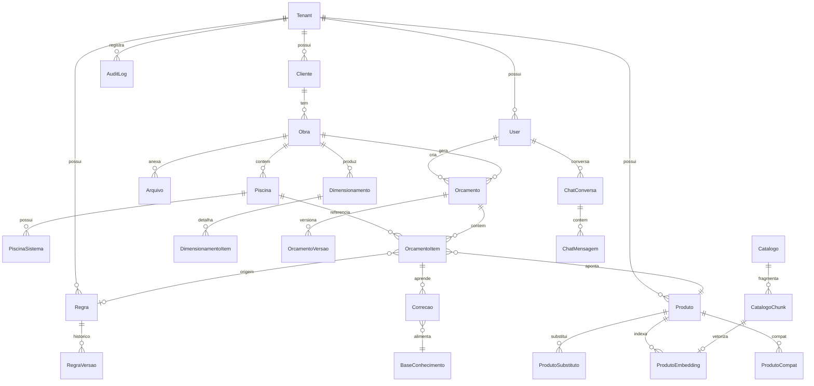

# 02 — Modelo de Dados (Entidades & ER)

> Implementação canônica: [`apps/api/prisma/schema.prisma`](../apps/api/prisma/schema.prisma).
> Este documento explica **o porquê**; o schema é a fonte da verdade.

## 1. Princípios

- **Multi-tenant por coluna**: quase toda tabela tem `tenantId` (FK → `Tenant`). Um middleware Prisma força o filtro — ver [ADR-0002](adr/0002-multi-tenant.md).
- **Soft-delete onde importa** (`deletedAt`) para clientes, obras, produtos, orçamentos.
- **Auditável**: `createdAt`, `updatedAt`, `createdById` nas entidades de negócio + `AuditLog` central.
- **Rastreabilidade de origem**: todo item de orçamento sabe se veio de **regra**, **IA/RAG** ou **ajuste manual**.
- **Versionamento**: regras e orçamentos versionados (histórico + comparação).

## 2. Diagrama ER (núcleo)



## 3. Entidades — propósito e campos-chave

### Núcleo & acesso
| Entidade | Propósito | Campos notáveis |
|----------|-----------|-----------------|
| **Tenant** | A empresa (isolamento). | `nome`, `slug`, `configuracoes` (JSON), `plano` |
| **User** | Usuário com perfil RBAC. | `email`, `passwordHash`, `role` (enum), `ativo` |
| **RefreshToken** | Rotação segura de sessão. | `tokenHash`, `expiresAt`, `revokedAt`, `userId` |

### Comercial
| Entidade | Propósito | Campos notáveis |
|----------|-----------|-----------------|
| **Cliente** | Pessoa/empresa. | `nome`, `documento`, `contatos`, `endereco` (JSON), `observacoes` |
| **Obra** | Projeto físico (uma obra → N piscinas). | `nome`, `endereco`, `cidade`, `status`, `clienteId` |
| **Arquivo** | Anexo da obra. | `tipo` (PDF/IMG/DWG/DOC), `storageKey`, `statusProcessamento`, `ocrConfianca` |

### Técnico
| Entidade | Propósito | Campos notáveis |
|----------|-----------|-----------------|
| **Piscina** | Espelho d'água com geometria. | `comprimento`, `largura`, `profundidade`, `volumeM3` (derivado), `tipo`, `interna`, `casaDeMaquinas` |
| **PiscinaSistema** | Sistema acoplado (prainha, borda infinita, cascata, spa, hidro, sauna, aquecimento, LED). | `tipo` (enum), `parametros` (JSON), `ativo` |

### Catálogo, produtos & IA
| Entidade | Propósito | Campos notáveis |
|----------|-----------|-----------------|
| **Catalogo** | Documento-fonte ingerido (PDF/Excel/CSV/DOC). | `fonte`, `storageKey`, `statusIndexacao` |
| **CatalogoChunk** | Pedaço de texto normalizado do catálogo. | `texto`, `metadata` (JSON), `catalogoId` |
| **Produto** | SKU comercializável. | `sku`, `categoria`, `fabricante`, `modelo`, `preco`, `unidade`, `status`, `especificacoes` (JSON: potência, vazão, volume…) |
| **ProdutoCompat / ProdutoSubstituto** | Grafos de compatibilidade/substituição (self-relation). | `produtoId`, `relacionadoId`, `nota` |
| **ProdutoEmbedding** | Vetor para busca semântica (RAG). | `embedding` (vector), `produtoId`/`chunkId` |

### Motor de regras
| Entidade | Propósito | Campos notáveis |
|----------|-----------|-----------------|
| **Regra** | Regra de engenharia editável pelo admin (sem código). | `nome`, `categoria`, `quando` (JSON-logic), `entao` (JSON-action), `prioridade`, `ativo` |
| **RegraVersao** | Snapshot histórico de uma regra. | `regraId`, `snapshot` (JSON), `versao` |

### Dimensionamento & orçamento
| Entidade | Propósito | Campos notáveis |
|----------|-----------|-----------------|
| **Dimensionamento** | Resultado de rodar o motor numa obra. | `obraId`, `status`, `geradoPorId`, `resumo` (JSON) |
| **DimensionamentoItem** | Necessidade técnica calculada (ex.: "3 LEDs", "bomba 0.5cv"). | `categoria`, `descricao`, `quantidade`, `regraId`, `produtoSugeridoId` |
| **Orcamento** | Proposta comercial. | `obraId`, `status`, `valorTotal`, `versaoAtual` |
| **OrcamentoVersao** | Snapshot completo + diff. | `orcamentoId`, `versao`, `snapshot` (JSON) |
| **OrcamentoItem** | Linha do orçamento. | `piscinaId`, `sistema`, `produtoId`, `quantidade`, `precoUnit`, **`origem`** (REGRA/IA/MANUAL), `regraId` |

### Aprendizado
| Entidade | Propósito | Campos notáveis |
|----------|-----------|-----------------|
| **Correcao** | Registro de alteração humana (de→para + justificativa). | `entidade`, `de` (JSON), `para` (JSON), `justificativa`, `autorId` |
| **BaseConhecimento** | Conhecimento consolidado que alimenta IA/regras. | `tipo`, `conteudo`, `tags`, `embedding` |

### Conversação & auditoria
| Entidade | Propósito | Campos notáveis |
|----------|-----------|-----------------|
| **ChatConversa / ChatMensagem** | Chat técnico lateral (RAG). | `papel` (user/assistant), `conteudo`, `fontes` (JSON) |
| **AuditLog** | Trilha completa. | `acao`, `entidade`, `entidadeId`, `antes` (JSON), `depois` (JSON), `autorId`, `ip` |

## 4. Enums principais

```
UserRole       = ADMIN | DIRETORIA | GERENTE | ORCAMENTISTA | COMERCIAL | CONSULTA
ArquivoTipo    = PDF | IMAGEM | DWG | DOCUMENTO
StatusProc     = PENDENTE | PROCESSANDO | CONCLUIDO | FALHA | REVISAO_MANUAL
SistemaTipo    = PRAINHA | BORDA_INFINITA | CASCATA | SPA | HIDROMASSAGEM | SAUNA | AQUECIMENTO | LED | TRATAMENTO | FILTRAGEM
ItemOrigem     = REGRA | IA_RAG | MANUAL
OrcamentoStatus= RASCUNHO | EM_REVISAO | APROVADO | ENVIADO | RECUSADO
RegraCategoria = ILUMINACAO | HIDRAULICA | FILTRAGEM | AQUECIMENTO | TRATAMENTO | MAO_DE_OBRA | ESTRUTURA
```

## 5. Índices & performance
- `@@index([tenantId])` em todas as tabelas multi-tenant.
- Índices compostos para listagens: `(tenantId, status, createdAt)`.
- `pgvector` com índice HNSW em `ProdutoEmbedding.embedding` (cosine).
- `sku` único **por tenant**: `@@unique([tenantId, sku])`.
