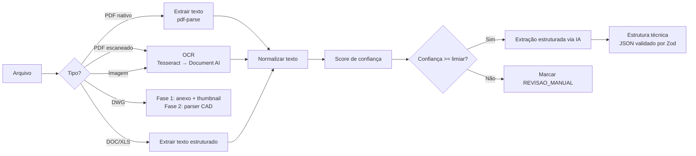
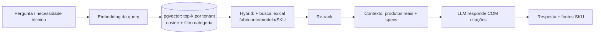
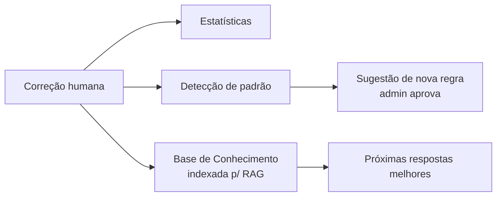

# 03 — Estratégia de IA, OCR e RAG

## 1. Filosofia: IA como copiloto, não piloto

| Tarefa | Quem decide | Por quê |
|--------|-------------|---------|
| **Dimensionar** (quantos LEDs, qual vazão) | **Motor de regras** (determinístico) | Orçamento precisa ser reproduzível e auditável |
| **Extrair dados do PDF** | IA + revisão humana | Linguagem natural, mas com confiança e correção |
| **Escolher SKU** | RAG sobre catálogo real | Nunca inventar produto |
| **Explicar / responder dúvida** | IA (chat RAG) | Conveniência, sempre citando fonte |

> **Regra inviolável:** a IA **nunca** afirma um produto/spec que não exista no banco. Sem fonte → resposta bloqueada ("não encontrei no catálogo").

---

## 2. OCR & Parsing (Leitura Inteligente)

### Pipeline (roda em worker, fila `processar-arquivo`)



### Estratégia de fallback
1. Tenta **texto nativo** do PDF (rápido, barato, exato).
2. Se vazio/insuficiente → **Tesseract** (local, sem custo).
3. Se confiança baixa → **Document AI / Textract** (pago, melhor em layout complexo).
4. Abaixo do limiar configurável → **revisão humana obrigatória**.

`OcrProvider` é uma **porta** (interface). Implementações: `TesseractOcr`, `DocumentAiOcr`. Troca por env `OCR_PROVIDER`.

### Extração estruturada
Saída **sempre** validada contra um schema Zod:

```ts
ProjetoExtraido = {
  piscinas: Array<{
    nome?: string
    comprimentoM?: number
    larguraM?: number
    profundidadeM?: number
    sistemas: Array<'PRAINHA'|'BORDA_INFINITA'|'CASCATA'|'SPA'|'HIDROMASSAGEM'|'SAUNA'|'AQUECIMENTO'|'LED'>
    observacoes?: string
    confianca: number   // 0..1 por campo
  }>
  avisos: string[]
}
```

A IA recebe instrução de **não preencher o que não viu** (campo ausente, não inventado). Cada campo carrega **confiança**; a UI destaca em amarelo o que precisa de conferência.

---

## 3. RAG (Retrieval-Augmented Generation)

### Ingestão de catálogos (fila `indexar-catalogo`)

```
Upload (PDF/Excel/CSV/DOC)
  → Extrair texto / linhas
  → Normalizar (fabricante, modelo, specs)
  → Chunking semântico (CatalogoChunk)
  → Gerar embeddings (text-embedding-3-large)
  → Gravar em ProdutoEmbedding (pgvector, namespace = tenantId)
```

### Recuperação (busca técnica / seleção de produto)



**Decisões de RAG:**
- **Híbrido** (vetorial + lexical): specs técnicas têm termos exatos (modelos, vazões) que busca puramente semântica erra.
- **Filtro por `tenantId` sempre** — isolamento total entre clientes.
- **Filtro por categoria** quando o contexto já sabe (ex.: "bomba" → categoria HIDRAULICA).
- **Citação obrigatória**: a resposta referencia `produtoId`/`sku`. Sem match relevante → IA responde que não há produto compatível, e sugere abrir chamado/cadastrar.
- **Cache (Redis)**: chave = hash(query normalizada + tenant + versão do catálogo). Reduz custo e latência.

### Chat técnico lateral
Perguntas como *"Qual bomba para 80m³?"* → o `IaService`:
1. Detecta intenção (seleção de produto vs. dúvida geral).
2. Para seleção: aplica regra de dimensionamento → vira critério de busca → RAG → resposta com SKUs reais + alternativas/substitutos.
3. Cada resposta guarda `fontes` (produtos citados) na `ChatMensagem` (rastreável).

---

## 4. Custos & modelos (por tarefa)

| Tarefa | Modelo (default) | Observação |
|--------|------------------|------------|
| Extração estruturada de projeto | `gpt-4o` | Precisão > custo; volume baixo |
| Chat técnico | `gpt-4o` | Qualidade de resposta |
| Embeddings | `text-embedding-3-large` | Catálogo + base de conhecimento |
| Classificação simples (intenção) | `gpt-4o-mini` | Barato, alto volume |

`AiProvider` abstrai tudo (ver [ADR-0003](adr/0003-provider-ia-abstraido.md)). Métricas de **tokens/custo/latência** por chamada → tabela de uso para o dashboard executivo.

---

## 5. Aprendizado contínuo (o diferencial)

Toda correção humana na **Revisão Técnica** gera um registro `Correcao` (de→para + justificativa). O `AprendizadoModule` consolida isso em três frentes:

1. **Estatística** → quais regras/itens mais são corrigidos (qualidade da IA cai/sobe).
2. **Sugestão de regra** → padrão recorrente vira proposta de nova `Regra` (admin aprova).
3. **Base de conhecimento (RAG)** → justificativas viram chunks indexados, melhorando respostas futuras.



> Isso fecha o loop: o sistema **fica melhor quanto mais é usado**, sem reprogramar.
