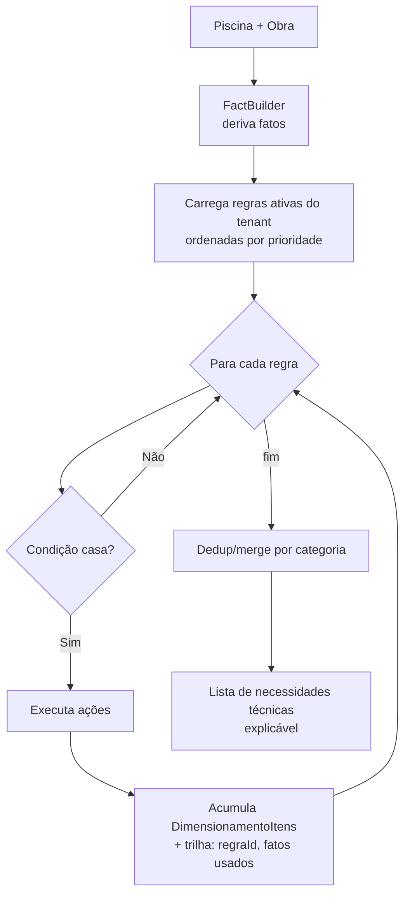

# 04 — Motor de Regras (o coração)

> Implementação: [`apps/api/src/modules/rule-engine/`](../apps/api/src/modules/rule-engine).
> Permite ao **administrador criar/editar regras sem programar**.

## 1. Objetivo

Transformar uma **piscina + seus sistemas** em uma **lista de necessidades técnicas**
(itens a orçar) de forma **determinística, explicável e configurável**.

Exemplos de regras do negócio (todos viram dado, não código):
- *LED a cada 1,5 m* de parede.
- *Piscina acima de 6 m de largura* → iluminação em duas paredes.
- *Retornos distribuídos* por volume.
- *Dimensionamento de filtragem por volume* (turnover).
- *Aquecimento por região* (clima).
- *Tratamento por volume*.
- *Mão de obra por complexidade*.

## 2. Anatomia de uma regra

Uma `Regra` é um JSON com **QUANDO** (condição) e **ENTÃO** (ações):

```jsonc
{
  "nome": "LED a cada 1,5m de borda",
  "categoria": "ILUMINACAO",
  "prioridade": 100,
  "ativo": true,
  "quando": {
    "todas": [
      { "fato": "piscina.tipo", "op": "in", "valor": ["EXTERNA", "INTERNA"] },
      { "fato": "piscina.sistemas", "op": "contem", "valor": "LED" }
    ]
  },
  "entao": [
    {
      "tipo": "ADICIONAR_ITEM",
      "categoria": "LED",
      "descricao": "Refletor LED de embutir",
      "quantidade": "teto(piscina.perimetroM / 1.5)",
      "criterioProduto": { "categoria": "LED", "atributos": { "tipo": "embutir" } }
    }
  ]
}
```

### Fatos disponíveis (derivados automaticamente)
O `FactBuilder` calcula, a partir da piscina/obra, fatos prontos para a condição:

| Fato | Cálculo |
|------|---------|
| `piscina.volumeM3` | `comprimento × largura × profundidadeMedia` |
| `piscina.areaM2` | `comprimento × largura` |
| `piscina.perimetroM` | `2 × (comprimento + largura)` |
| `piscina.larguraM`, `comprimentoM`, `profundidadeM` | diretos |
| `piscina.tipo`, `piscina.interna` | diretos |
| `piscina.sistemas` | lista de sistemas ativos |
| `obra.cidade`, `obra.regiao` | para regras climáticas |

### Operadores de condição
`=, !=, >, >=, <, <=, in, contem, entre`. Combinadores: `todas` (AND), `alguma` (OR), `nao` (NOT) — aninháveis.

### Ações (`entao`)
| Ação | Efeito |
|------|--------|
| `ADICIONAR_ITEM` | Cria `DimensionamentoItem` (qtd por expressão segura) |
| `DEFINIR_ATRIBUTO` | Define parâmetro de cálculo (ex.: turnover) |
| `EXIGIR_PRODUTO` | Marca produto/categoria obrigatório |
| `AVISO` | Gera alerta de revisão (ex.: "região quente: revisar aquecimento") |

## 3. Avaliador de expressões (seguro)

Quantidades como `teto(piscina.perimetroM / 1.5)` são calculadas por um **avaliador próprio**
(sem `eval`): tokeniza → parser de precedência → AST → avalia com whitelist de funções
(`teto`, `piso`, `arredondar`, `min`, `max`, `raiz`) e acesso somente-leitura aos fatos.
Isso evita injeção e mantém o cálculo auditável.

## 4. Fluxo de avaliação



**Saída explicável:** cada item carrega `regraId` e os fatos que dispararam — a Revisão Técnica mostra *"3 LEDs porque perímetro 4,2 m ÷ 1,5 (regra X)"*. Rastreabilidade total.

## 5. Por que determinístico (e não "deixa a IA decidir")
- **Reprodutível**: mesmo input → mesmo orçamento. Essencial para confiança comercial.
- **Auditável**: dá para explicar cada número ao cliente.
- **Barato**: roda em ms, sem custo de token.
- **Governável**: o admin muda a política da empresa editando regra, não esperando deploy.

A IA entra **depois**: escolhe o **produto real** (RAG) que atende a necessidade calculada, e **explica** em linguagem natural. E o **aprendizado** sugere novas regras a partir de correções (ver `03-IA-OCR-RAG.md`).

## 6. Governança de regras
- **Versionamento** (`RegraVersao`): toda edição salva snapshot; dá para comparar e reverter.
- **Simulação**: admin testa uma regra contra piscinas de exemplo antes de ativar ("dry-run").
- **Prioridade & conflito**: regras ordenadas por `prioridade`; merge final remove duplicidade por categoria, mantendo a de maior prioridade + avisos.
